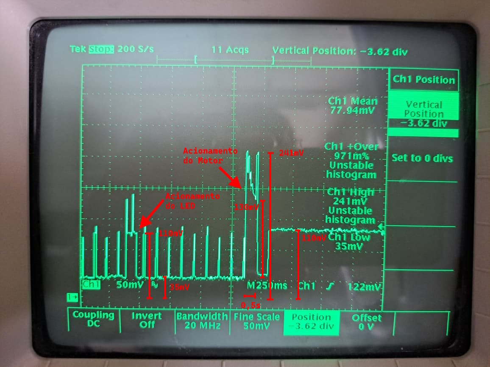
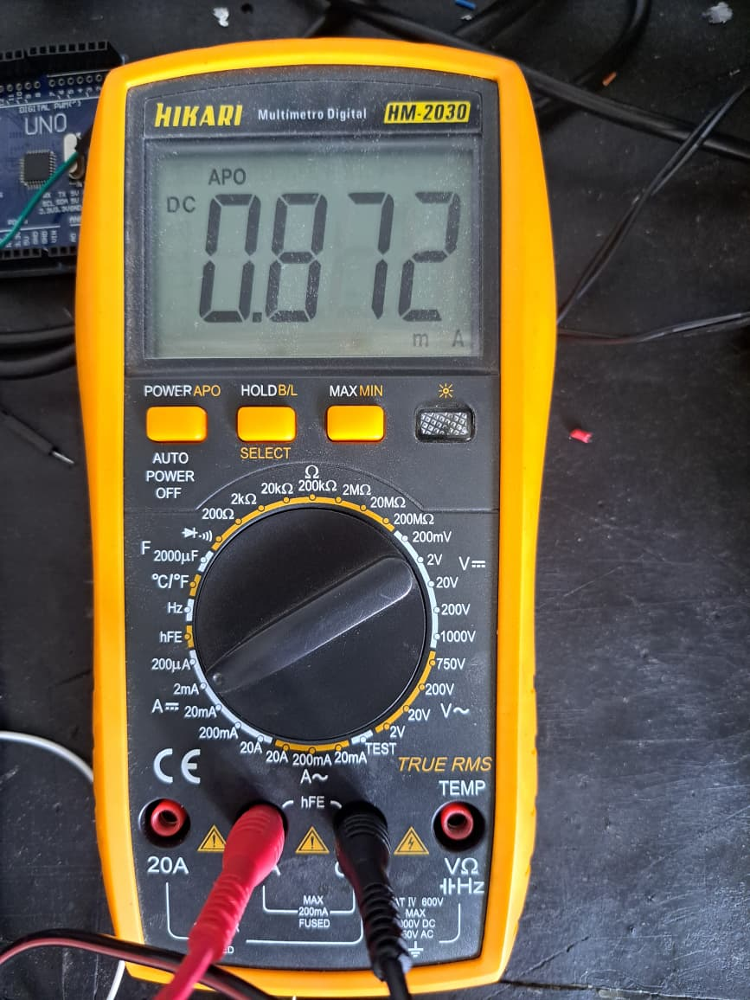

# TCC-IrrigadorAutomatico

## Introdução

Este projeto pertence a um trabalho de conclusão de curso (TCC) e consiste no reaproveitamento de dois aparelhos de irrigação defeituosos.

Os dois irrigadores aprimorados estão mostrados nas imagens a seguir:

  
  

## Organização

O repositório possui duas pastas: "text", na qual o texto do TCC é escrito usando LaTeX, e "microcontroller", que contém os códigos para o microcontrolador ESP-12E.
O código para Android Studio do aplicativo para controle do irrigador está no repositório https://github.com/Jvsaade/IrrigadorAuto.

## Montagem

A montagem a seguir mostra um diagrama de blocos com as conexões feitas entre os componentes do circuito.

## Análise de consumo
Para verificar o consumo do irrigador em cada estado de funcionamento, foram feitas medições utilizando um osciloscópio e um multímetro.

### Durante a irrigação
A imagem a seguir mostra a medição no osciloscópio nos terminais de um resistor shunt com valor 1,8Ω durante o fim de uma irrigação:

Transformando as medições em valores de corrente, observa-se um consumo de 19,4 mA durante a irrigação, e de 61,1 mA durante o acionamento do led.
A abertura da válvula é de curta duração (~500 ms), e dá um consumo médio de 103 mA, o que está dentro dos valores esperados (50mA-300mA).

### Deep Sleep
Para medir o consumo durante o estado de Deep Sleep, foi utilizado um multímetro na escala de 2mV, como mostrado na imagem:

Esse valor é maior do que o especificado no datasheet do ESP8266 (20μA-100μA). Pode-se explicar esse comportamento pelo uso do regulador step up, que ao aumentar a tensão exige uma corrente maior na entrada. Além disso, a ponte H, que está diretamente ligada às pilhas, não é desligada nesse modo, mantendo o led de funcionamento aceso.
