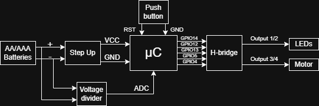

# TCC-IrrigadorAutomatico

## Introdução

Este projeto pertence a um trabalho de conclusão de curso (TCC) e consiste no reaproveitamento de dois aparelhos de irrigação defeituosos.

O irrigador da marca Amanco é mostrado na figura abaixo:

)

O irrigador da marca Trato é mostrado abaixo:

## Organização

O repositório possui duas pastas: "text", na qual o texto do TCC é escrito usando LaTeX, e "microcontroller", que contém os códigos para o microcontrolador ESP-12E.
O código para Android Studio do aplicativo para controle do irrigador está no repositório https://github.com/Jvsaade/IrrigadorAuto.

## Montagem

A montagem a seguir mostra um diagrama de blocos com as conexões feitas entre os componentes do circuito.

